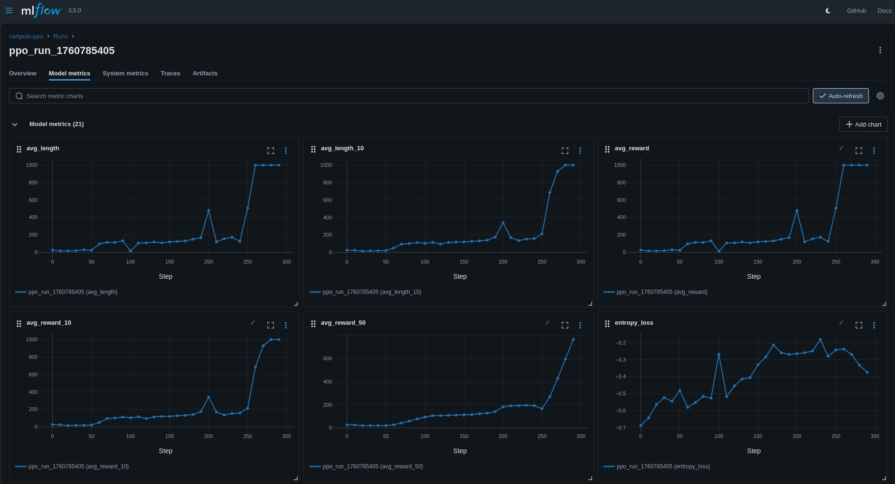

# CartPole PPO with JAX

A reinforcement learning implementation of Proximal Policy Optimization (PPO) for CartPole using JAX, with MLflow experiment tracking.

## Quick Start

```bash
# Enter development environment
nix develop

# Start MLflow tracking server (runs on http://localhost:5000)
just start-mlflow

# Train a model
python scripts/train.py --episodes 1000

# Evaluate the trained model
python scripts/evaluate.py --checkpoint models/best_model.pkl
```

> **MLflow Server**: The tracking server provides a web interface at `http://localhost:5000` for monitoring training progress, comparing experiments, and visualizing metrics. Use `just stop-mlflow` to shut it down when done.

## Development

```bash
# Run tests
just test

# Clean up artifacts
just clean
```

## Project Structure

- `src/` - Core implementation (agents, environment, training, visualization)
- `scripts/` - Command-line tools for training and evaluation
- `tests/` - Unit and integration tests
- `data/` - MLflow artifacts and logs

## Demo & Visualization

### CartPole Demo Video


### MLflow Dashboard


The demo video shows a trained CartPole agent successfully balancing the pole using the PPO algorithm. The MLflow dashboard provides comprehensive experiment tracking with metrics visualization, hyperparameter logging, and model artifact management.

## Documentation

- [Scripts usage](scripts/README.md) - Detailed training and evaluation options
- [Agent module](src/agent/README.md) - PPO agent implementation with JAX and Flax
- [Environment module](src/environment/README.md) - CartPole environment wrapper and utilities
- [Training module](src/training/README.md) - Training infrastructure and PPO trainer
- [Visualization module](src/visualization/README.md) - MLflow integration and plotting utilities
