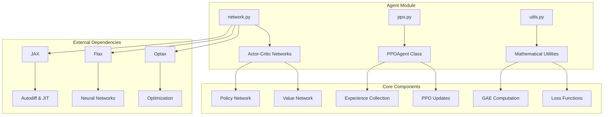
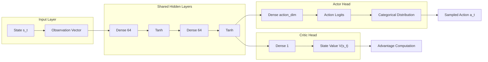
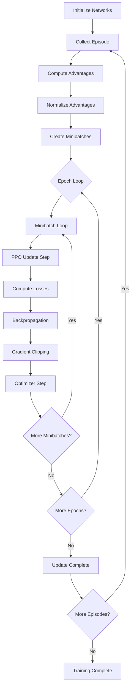

# PPO Agent Module

This module implements a Proximal Policy Optimization (PPO) agent using JAX for high-performance differentiable computing and Flax for neural network architectures. The implementation focuses on mathematical rigor, computational efficiency, and reproducibility.

## Architecture Overview



## Mathematical Foundation

### PPO Objective Function

The PPO algorithm optimizes the following **clipped surrogate objective**:

$$L^{CLIP}(\theta) = \mathbb{E}_t \left[ \min\left(r_t(\theta) A_t, \text{clip}(r_t(\theta), 1-\epsilon, 1+\epsilon) A_t\right) \right]$$

Where:
- $r_t(\theta) = \frac{\pi_\theta(a_t|s_t)}{\pi_{\theta_{old}}(a_t|s_t)}$ is the probability ratio
- $A_t$ are the advantage estimates
- $\epsilon$ is the clipping parameter (typically 0.2)

### Complete PPO Loss Function

The total loss combines three components:

$$L^{PPO}(\theta) = L^{CLIP}(\theta) - c_1 L^{VF}(\theta) + c_2 S[\pi_\theta](s_t)$$

Where:
- $L^{VF}(\theta) = \mathbb{E}_t \left[ (V_\theta(s_t) - V_t^{target})^2 \right]$ is the value function loss
- $S[\pi_\theta](s_t) = \mathbb{E}_{a \sim \pi_\theta} [-\log \pi_\theta(a|s_t)]$ is the entropy bonus
- $c_1, c_2$ are coefficients for value loss and entropy respectively

### Generalized Advantage Estimation (GAE)

GAE provides variance-reduced advantage estimates:

$$A_t^{GAE}(\gamma, \lambda) = \sum_{l=0}^{\infty} (\gamma \lambda)^l \delta_{t+l}^V$$

Where the TD error is:
$$\delta_t^V = r_t + \gamma V(s_{t+1}) - V(s_t)$$

## Network Architecture

### Actor-Critic Design



### Mathematical Forward Pass

For a given state $s \in \mathbb{R}^n$:

1. **Hidden Layers**:
   $$h_1 = \tanh(W_1 s + b_1)$$
   $$h_2 = \tanh(W_2 h_1 + b_2)$$

2. **Actor Output**:
   $$\pi(a|s) = \text{softmax}(W_{actor} h_2 + b_{actor})$$

3. **Critic Output**:
   $$V(s) = W_{critic} h_2 + b_{critic}$$

## Implementation Details

### JAX-Specific Optimizations

#### Vectorization with `vmap`
```python
# Vectorized action evaluation
current_log_probs = jax.vmap(evaluate_action)(action_logits, actions)
entropy = jax.vmap(get_entropy)(action_logits)
```

#### JIT Compilation
```python
@partial(jax.jit, static_argnums=(0,))
def update_step(self, network_params, optimizer_state, ...):
    # JIT-compiled PPO update step
```

#### Efficient Scanning for GAE
```python
def _gae_scan(carry, td_error):
    gae = carry * lambda_gae * gamma + td_error
    return gae, gae

_, advantages = jax.lax.scan(_gae_scan, jnp.zeros_like(td_errors[-1]), 
                           td_errors, reverse=True)
```

### Gradient Clipping

Implementation of gradient norm clipping for training stability:

```python
grad_norm = optax.global_norm(grads)
scale = jnp.minimum(1.0, max_grad_norm / (grad_norm + 1e-8))
grads = jax.tree_util.tree_map(lambda g: g * scale, grads)
```

## Training Algorithm



### PPO Update Step Mathematics

For each minibatch, the update follows:

1. **Forward Pass**:
   $$\pi_\theta(a_t|s_t), V_\theta(s_t) = \text{Network}_\theta(s_t)$$

2. **Loss Computation**:
   $$\mathcal{L}(\theta) = \mathcal{L}^{CLIP}(\theta) + c_1 \mathcal{L}^{VF}(\theta) - c_2 \mathcal{S}[\pi_\theta](s_t)$$

3. **Gradient Computation**:
   $$\nabla_\theta \mathcal{L}(\theta) = \frac{\partial \mathcal{L}}{\partial \theta}$$

4. **Gradient Clipping**:
   $$\nabla_\theta \mathcal{L}_{clipped} = \min\left(\|\nabla_\theta \mathcal{L}\|_2, g_{max}\right) \frac{\nabla_\theta \mathcal{L}}{\|\nabla_\theta \mathcal{L}\|_2}$$

5. **Parameter Update**:
   $$\theta_{t+1} = \theta_t - \alpha \nabla_\theta \mathcal{L}_{clipped}$$

## Key Components

### Network Module (`network.py`)

- **ActorNetwork**: Policy network with categorical action distribution
- **CriticNetwork**: Value function approximation
- **PPONetwork**: Combined actor-critic architecture
- **Utility Functions**: Action sampling, probability evaluation, entropy computation

### PPO Agent (`ppo.py`)

- **PPOAgent**: Main agent class implementing the complete PPO algorithm
- **Experience Collection**: Episode rollout with action sampling
- **Training Loop**: Multi-epoch PPO updates with minibatch processing

### Utilities (`utils.py`)

- **GAE Computation**: Generalized Advantage Estimation implementation
- **Loss Functions**: PPO clipped surrogate loss with value and entropy terms
- **Optimization**: Adam optimizer setup and gradient clipping
- **Data Processing**: Minibatch creation and advantage normalization

## Hyperparameters

| Parameter | Default | Description |
|-----------|---------|-------------|
| `learning_rate` | 3e-4 | Adam optimizer learning rate |
| `clip_epsilon` | 0.2 | PPO clipping parameter |
| `gamma` | 0.99 | Discount factor |
| `gae_lambda` | 0.95 | GAE lambda parameter |
| `entropy_coef` | 0.01 | Entropy regularization coefficient |
| `value_coef` | 0.5 | Value function loss coefficient |
| `max_grad_norm` | 0.5 | Maximum gradient norm for clipping |
| `epochs_per_update` | 10 | Number of PPO epochs per update |
| `batch_size` | 64 | Experience collection batch size |
| `minibatch_size` | 64 | Minibatch size for updates |

## Usage Example

```python
from src.agent import PPOAgent

# Initialize agent
agent = PPOAgent(
    observation_dim=4,  # CartPole observation space
    action_dim=2,       # CartPole action space
    learning_rate=3e-4,
    clip_epsilon=0.2
)

# Training step
network_params, optimizer_state, stats = agent.train_step(
    network_params, optimizer_state, env, key
)
```

## Performance Considerations

### JAX Transformations
- **JIT Compilation**: All update steps are JIT-compiled for maximum performance
- **Vectorization**: Batch processing using `vmap` for parallel computation
- **Memory Efficiency**: Functional programming style avoids in-place modifications

### Numerical Stability
- **Gradient Clipping**: Prevents exploding gradients
- **Advantage Normalization**: Stabilizes training by normalizing advantages
- **Entropy Regularization**: Encourages exploration and prevents premature convergence

## Mathematical Notation Reference

- $\pi_\theta(a|s)$: Policy parameterized by $\theta$
- $V_\theta(s)$: Value function parameterized by $\theta$
- $A_t$: Advantage estimate at timestep $t$
- $R_t$: Return (cumulative discounted reward) at timestep $t$
- $\gamma$: Discount factor
- $\lambda$: GAE parameter
- $\epsilon$: PPO clipping parameter
- $\alpha$: Learning rate
- $c_1, c_2$: Loss coefficients for value and entropy terms