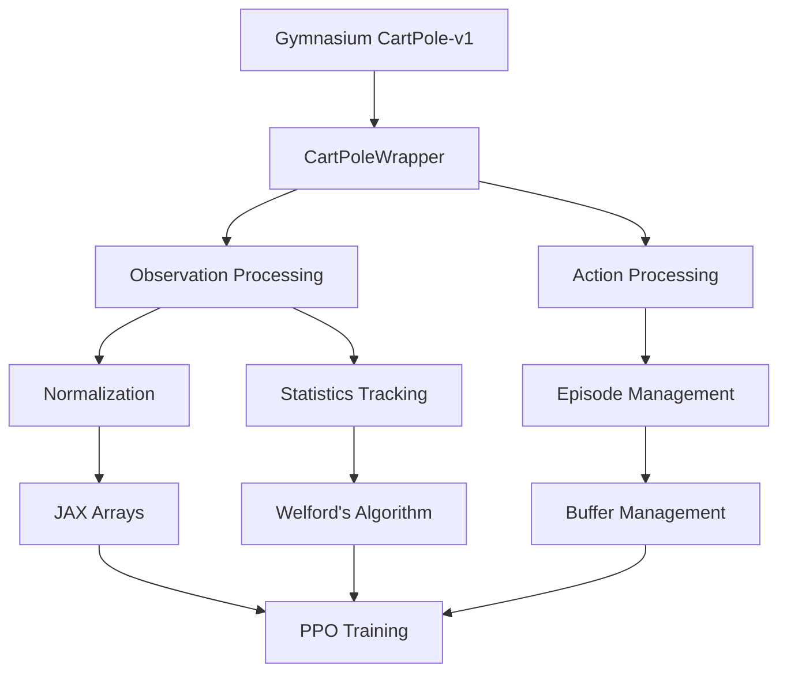
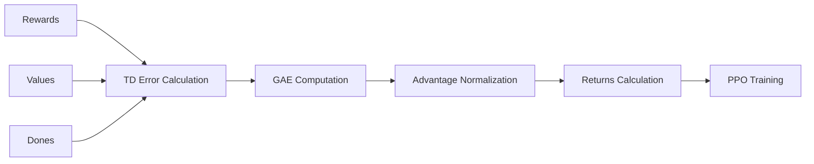
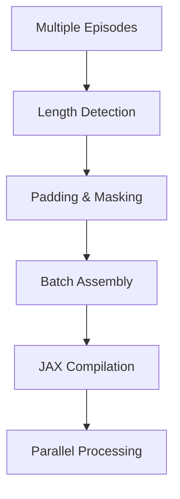

# Environment Module

The `src/environment` module provides JAX-compatible environment wrappers and utilities for the CartPole-v1 reinforcement learning environment. This module focuses on efficient data processing, mathematical transformations, and batch operations optimized for PPO training.

## Architecture Overview



## Core Components

### CartPoleWrapper (`cartpole.py`)

The main environment wrapper that provides JAX-compatible interfaces with advanced normalization and statistics tracking.

#### Mathematical Foundation

**Observation Space**: $\mathcal{O} \in \mathbb{R}^4$
- Cart position: $x \in [-4.8, 4.8]$ meters
- Cart velocity: $\dot{x} \in [-\infty, \infty]$ (practically bounded to ±10)
- Pole angle: $\theta \in [-0.418, 0.418]$ radians (±24°)
- Pole angular velocity: $\dot{\theta} \in [-\infty, \infty]$ (practically bounded to ±10)

**Action Space**: $\mathcal{A} \in \{0, 1\}$
- 0: Push cart to the left
- 1: Push cart to the right

**Reward Function**: $r_t = 1$ for each timestep where pole remains balanced

#### Normalization Implementation

The wrapper implements online normalization using running statistics:

$$\hat{o}_t = \frac{o_t - \mu_t}{\sigma_t + \epsilon}$$

Where $\mu_t$ and $\sigma_t$ are updated using Welford's algorithm:

$$\delta_t = o_t - \mu_{t-1}$$
$$\mu_t = \mu_{t-1} + \frac{\delta_t}{t}$$
$$M_{2,t} = M_{2,t-1} + \delta_t \cdot (o_t - \mu_t)$$
$$\sigma_t = \sqrt{\frac{M_{2,t}}{t-1} + \epsilon}$$

#### Key Methods

- `reset()`: Initialize environment with optional normalization
- `step()`: Execute action and return processed observations
- `batch_normalize_observations()`: JAX-compiled batch normalization
- `compute_episode_returns()`: Discounted return calculation using scan operations

### Environment Utilities (`utils.py`)

Advanced mathematical utilities for episode processing and advantage computation.

#### Generalized Advantage Estimation (GAE)

The GAE algorithm computes advantages with exponential smoothing:

$$\delta_t = r_t + \gamma V(s_{t+1}) \cdot (1 - d_t) - V(s_t)$$

$$A_t^{GAE} = \sum_{l=0}^{\infty} (\gamma \lambda)^l \delta_{t+l}$$

Implemented efficiently using JAX's `lax.scan`:



#### Episode Buffer Management

Structured data storage for efficient batch processing:

```python
buffer = {
    'observations': jnp.zeros((T, 4)),      # T × 4 observation matrix
    'actions': jnp.zeros(T, dtype=jnp.int32),  # T action vector
    'rewards': jnp.zeros(T),                # T reward vector
    'dones': jnp.zeros(T, dtype=jnp.bool_), # T termination flags
    'log_probs': jnp.zeros(T),              # T log probabilities
    'values': jnp.zeros(T),                 # T value estimates
}
```

## Mathematical Operations

### Discounted Return Computation

The module computes discounted returns using backward accumulation:

$$R_t = \sum_{k=0}^{T-t-1} \gamma^k r_{t+k} \cdot \prod_{i=0}^{k-1} (1 - d_{t+i})$$

This is implemented efficiently with JAX's scan operation for parallelization.

### Advantage Normalization

Advantages are normalized to zero mean and unit variance:

$$\hat{A}_t = \frac{A_t - \mu_A}{\sigma_A + \epsilon}$$

Where $\mu_A = \frac{1}{T}\sum_{t=1}^T A_t$ and $\sigma_A = \sqrt{\frac{1}{T}\sum_{t=1}^T (A_t - \mu_A)^2}$

### Batch Processing Operations

The module supports efficient batch processing with masking:



## JAX Optimizations

### JIT Compilation

Key functions are JIT-compiled for performance:

- `batch_normalize_observations`: Vectorized normalization across batches
- `compute_episode_returns`: Efficient return calculation with scan
- `compute_advantages_and_returns`: GAE computation with backward scan

### Memory Efficiency

The implementation uses:
- In-place operations with `jnp.ndarray.at[]`
- Structured buffers to minimize allocations
- Lazy evaluation through JAX's functional programming model

## Usage Examples

### Basic Environment Setup

```python
from src.environment import CartPoleWrapper

# Create normalized environment
env = CartPoleWrapper(
    render_mode=None,
    max_episode_steps=500,
    normalize_observations=True
)

# Reset environment
obs, info = env.reset(seed=42)
```

### Batch Processing

```python
from src.environment.utils import batch_episodes, compute_advantages_and_returns

# Batch multiple episodes
batched_data = batch_episodes(episodes)

# Compute GAE advantages
advantages, returns = compute_advantages_and_returns(
    rewards=batched_data['rewards'],
    values=batched_data['values'],
    dones=batched_data['dones'],
    gamma=0.99,
    gae_lambda=0.95
)
```

### Custom Normalization

```python
# Set custom normalization statistics
env.set_normalization_stats(
    mean=jnp.array([0.0, 0.0, 0.0, 0.0]),
    std=jnp.array([4.8, 10.0, 0.42, 10.0])
)
```

## Performance Considerations

### Computational Complexity

- **Normalization**: O(1) per observation with constant-time statistics updates
- **GAE Computation**: O(T) per episode using single backward pass
- **Batch Processing**: O(B×T) where B is batch size, T is max episode length

### Memory Usage

- Episode buffers: O(T×4) for observations + O(T) for other arrays
- Batch processing: O(B×T×4) for batched observations
- Statistics tracking: O(1) additional memory for running stats

## Integration with PPO

The environment module is designed to work seamlessly with the PPO algorithm:

1. **Observation preprocessing** ensures stable neural network inputs
2. **Advantage computation** provides the critic targets for PPO updates
3. **Batch processing** enables efficient mini-batch training
4. **JAX compatibility** allows for GPU/TPU acceleration

The mathematical formulations follow the standard PPO implementation with:
- Clipped surrogate objective for policy updates
- Value function minimization for critic training
- Entropy regularization for exploration

## Testing and Validation

The module includes comprehensive validation functions:

- `validate_episode_data()`: Checks data consistency and shapes
- `compute_episode_statistics()`: Calculates episode metrics
- `get_cartpole_observation_bounds()`: Provides environment limits

These ensure data integrity throughout the training pipeline and help debug issues in the reinforcement learning loop.