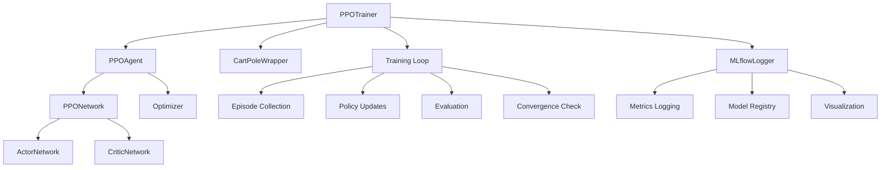
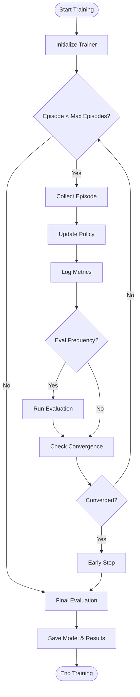
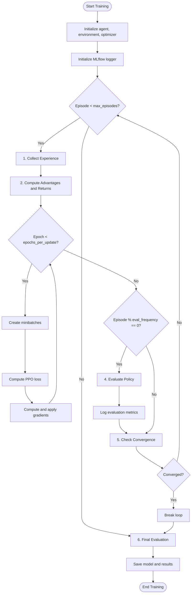

# Training Module Documentation

## Overview

The `src/training` module implements the training infrastructure for Proximal Policy Optimization (PPO) agents in JAX. This module provides a complete training pipeline that handles experience collection, policy updates, evaluation, and experiment tracking through MLflow.

## Architecture



## Core Components

### PPOTrainer Class

The `PPOTrainer` orchestrates the entire training process with the following responsibilities:

- **Experience Collection**: Gathers trajectories from the environment
- **Policy Updates**: Applies PPO algorithm updates to the agent
- **Evaluation**: Assesses policy performance on separate episodes
- **Convergence Monitoring**: Tracks training progress and implements early stopping
- **Experiment Tracking**: Logs metrics, hyperparameters, and artifacts to MLflow

### Training Flow



## Mathematical Implementation

### PPO Objective Function

The training module implements the clipped PPO objective:

$$L^{CLIP}(\theta) = \mathbb{E}_t \left[ \min\left(r_t(\theta) A_t, \text{clip}(r_t(\theta), 1-\epsilon, 1+\epsilon) A_t\right) \right]$$

Where:
- $r_t(\theta) = \frac{\pi_\theta(a_t|s_t)}{\pi_{\theta_{old}}(a_t|s_t)}$ is the probability ratio
- $A_t$ are the advantage estimates
- $\epsilon$ is the clipping parameter (typically 0.2)

### Total Loss Function

The complete loss function combines multiple components:

$$L(\theta) = L^{CLIP}(\theta) + c_1 L^{VF}(\theta) - c_2 L^{entropy}(\theta)$$

Where:
- $L^{VF}(\theta) = \mathbb{E}_t[(V_\theta(s_t) - V^{target}_t)^2]$ is the value function loss
- $L^{entropy}(\theta) = \mathbb{E}_t[\mathcal{H}(\pi_\theta(\cdot|s_t))]$ is the entropy bonus
- $c_1$ and $c_2$ are coefficients balancing the terms

### Generalized Advantage Estimation (GAE)

The module uses GAE for computing advantage estimates:

$$\hat{A}_t^{GAE(\gamma,\lambda)} = \sum_{l=0}^{\infty} (\gamma\lambda)^l \delta_{t+l}^V$$

Where the TD error is:
$$\delta_t^V = V(s_t) + \gamma V(s_{t+1}) - V(s_t)$$

### Value Function Updates

Value targets are computed as:
$$V^{target}_t = \sum_{l=0}^{\infty} \gamma^l r_{t+l}$$

In practice, this is computed efficiently using reverse scan operations.

## JAX-Specific Optimizations

### Vectorized Operations

The training module leverages JAX's vectorization capabilities:

```python
# Vectorized action evaluation
current_log_probs = jax.vmap(evaluate_action)(action_logits, actions)

# Vectorized entropy computation
entropy = jax.vmap(get_entropy)(action_logits)
```

### JIT Compilation

Critical computation paths are JIT-compiled for performance:

```python
@partial(jax.jit, static_argnums=(0,))
def update_step(self, network_params, optimizer_state, ...):
    # JIT-compiled PPO update step
```

### Efficient Scanning

The module uses `jax.lax.scan` for efficient temporal computations:

```python
# GAE computation using reverse scan
_, advantages = jax.lax.scan(
    _gae_scan,
    jnp.zeros_like(td_errors[-1]),
    td_errors,
    reverse=True
)
```

## Training Algorithm



## Key Features

### Experience Collection

The trainer collects structured episode data containing:

```python
episode_data = {
    'observations': jnp.ndarray,      # State observations
    'actions': jnp.ndarray,           # Actions taken
    'rewards': jnp.ndarray,           # Received rewards
    'next_observations': jnp.ndarray, # Next states
    'dones': jnp.ndarray,             # Episode termination flags
    'log_probs': jnp.ndarray,         # Action log probabilities
    'values': jnp.ndarray             # State value estimates
}
```

### Gradient Clipping

To ensure training stability, gradients are clipped:

```python
grad_norm = optax.global_norm(grads)
scale = jnp.minimum(1.0, max_grad_norm / (grad_norm + 1e-8))
grads = jax.tree_util.tree_map(lambda g: g * scale, grads)
```

### Convergence Monitoring

The trainer implements sophisticated convergence checking:

- **Sliding Window**: Uses a configurable window of recent episodes
- **Patience Mechanism**: Requires consistent performance before stopping
- **Best Performance Tracking**: Maintains best average reward seen

### MLflow Integration

Comprehensive experiment tracking includes:

- **Hyperparameter Logging**: All training configuration
- **Real-time Metrics**: Training and evaluation metrics
- **Artifact Storage**: Models, plots, and analysis reports
- **Model Registry**: Automatic registration of converged models

## Configuration Parameters

### Training Hyperparameters

| Parameter | Default | Description |
|-----------|---------|-------------|
| `max_episodes` | 1000 | Maximum training episodes |
| `max_steps_per_episode` | 500 | Maximum steps per episode |
| `target_reward` | 195.0 | Target average reward for convergence |
| `convergence_window` | 100 | Window size for convergence checking (default 20 in train.py script) |
| `early_stopping_patience` | 10 | Episodes to wait after convergence |
| `eval_frequency` | 50 | Frequency of evaluation episodes |
| `eval_episodes` | 10 | Number of episodes for evaluation |

### PPO Algorithm Parameters

| Parameter | Default | Description |
|-----------|---------|-------------|
| `learning_rate` | 3e-4 | Adam optimizer learning rate |
| `clip_epsilon` | 0.2 | PPO clipping parameter |
| `gamma` | 0.99 | Discount factor |
| `gae_lambda` | 0.95 | GAE lambda parameter |
| `entropy_coef` | 0.01 | Entropy regularization coefficient |
| `value_coef` | 0.5 | Value function loss coefficient |
| `max_grad_norm` | 0.5 | Maximum gradient norm for clipping |
| `epochs_per_update` | 10 | Number of epochs per PPO update |
| `batch_size` | 64 | Batch size for collecting experience |
| `minibatch_size` | 64 | Mini-batch size for updates |

## Usage Examples

### Basic Training

```python
from src.training import PPOTrainer
from src.agent import PPOAgent
from src.environment import CartPoleWrapper

# Create agent and environment
agent = PPOAgent(observation_dim=4, action_dim=2)
env = CartPoleWrapper()

# Create trainer
trainer = PPOTrainer(
    agent=agent,
    env=env,
    max_episodes=1000,
    target_reward=195.0,
    enable_mlflow=True
)

# Run training
results = trainer.train()
```

### Custom Callback

```python
def custom_callback(metrics):
    episode = metrics['episode']
    step_metrics = metrics['step_metrics']
    
    if episode % 100 == 0:
        print(f"Episode {episode}: Reward = {step_metrics['avg_reward']:.2f}")

results = trainer.train(callback=custom_callback)
```

### Evaluation Only

```python
# Load trained agent and evaluate
eval_metrics = trainer.evaluate(num_episodes=100)
print(f"Evaluation reward: {eval_metrics['avg_reward']:.2f} ± {eval_metrics['std_reward']:.2f}")
```

## Performance Considerations

### Memory Efficiency

- **Batch Processing**: Processes multiple episodes in batches
- **Gradient Accumulation**: Uses minibatches for memory-efficient updates
- **JAX Arrays**: Leverages JAX's memory-efficient array operations

### Computational Efficiency

- **JIT Compilation**: Critical paths are compiled for speed
- **Vectorization**: Batch operations are fully vectorized
- **Efficient Scanning**: Temporal computations use optimized scan operations

### Numerical Stability

- **Advantage Normalization**: Normalizes advantages for stable training
- **Gradient Clipping**: Prevents gradient explosion
- **Epsilon Handling**: Small constants prevent division by zero

## Testing and Validation

The module includes comprehensive tests covering:

- **Unit Tests**: Individual component functionality
- **Integration Tests**: End-to-end training workflows
- **Performance Tests**: Convergence and stability validation
- **MLflow Tests**: Experiment tracking verification

Run tests with:
```bash
nix develop --command python -m pytest tests/test_training.py -v
```

## Troubleshooting

### Common Issues

1. **Slow Convergence**: Adjust learning rate or entropy coefficient
2. **Instability**: Check gradient clipping and advantage normalization
3. **Memory Issues**: Reduce batch size or minibatch size
4. **MLflow Errors**: Ensure MLflow server is running

### Debug Mode

Enable verbose logging for debugging:
```python
trainer = PPOTrainer(
    ...,
    log_frequency=1,  # Log every episode
    enable_mlflow=True
)
```

## Future Extensions

Potential enhancements to the training module:

- **Distributed Training**: Multi-GPU and multi-node support
- **Curriculum Learning**: Adaptive difficulty scheduling
- **Advanced Algorithms**: Integration of PPO variants
- **Hyperparameter Optimization**: Automated tuning integration
- **Real-time Monitoring**: Live training dashboards