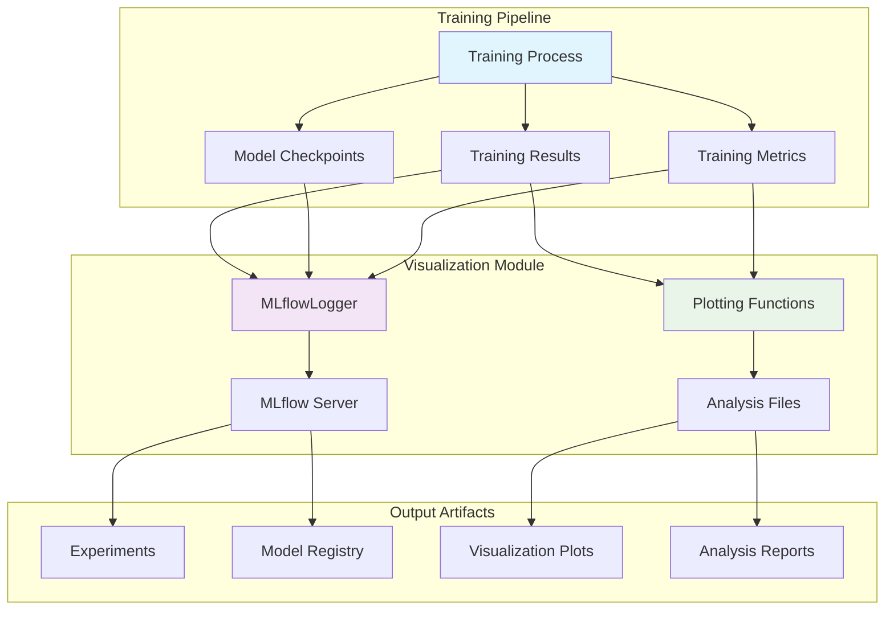
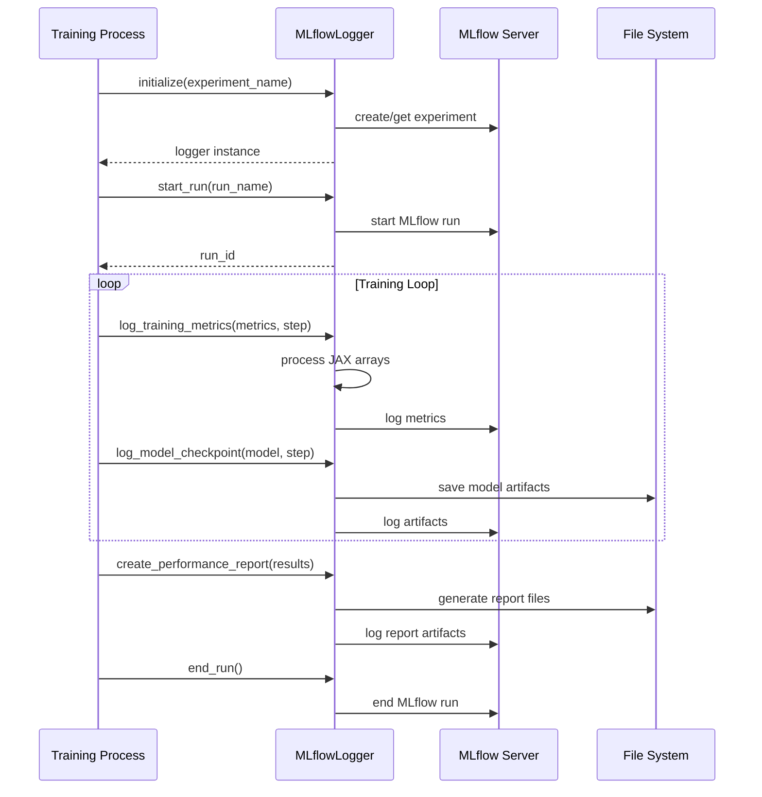
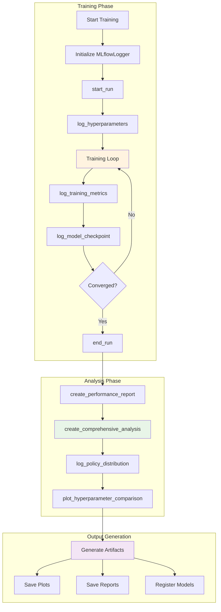
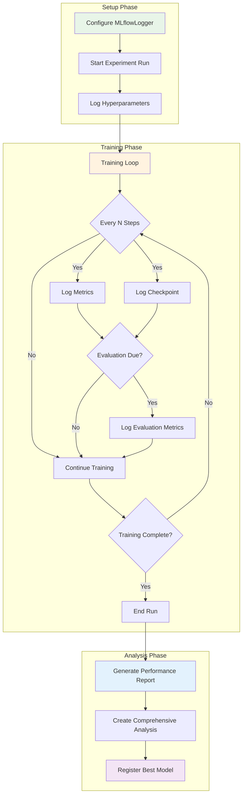

# Visualization Module

The `src/visualization` module provides comprehensive visualization and experiment tracking capabilities for the CartPole PPO implementation using JAX. It integrates with MLflow for experiment tracking and offers various plotting utilities for analyzing training progress, policy behavior, and hyperparameter performance.

## Module Structure

```
src/visualization/
├── __init__.py          # Module initialization
├── mlflow_logger.py     # MLflow integration and experiment tracking
├── plots.py            # Visualization utilities and plotting functions
└── README.md           # This documentation
```

## Architecture Overview



## Core Components

### MLflowLogger (`mlflow_logger.py`)

The `MLflowLogger` class provides comprehensive experiment tracking with MLflow, supporting:

- **Experiment Management**: Create and manage MLflow experiments
- **Model Logging**: Log Flax models with proper serialization using pickle
- **Metrics Tracking**: Log training, evaluation, and episode metrics with JAX array handling
- **Hyperparameter Logging**: Track hyperparameter configurations with type conversion
- **Artifact Management**: Save plots, models, and analysis results using native `mlflow.log_figure`
- **Model Registry**: Register and version trained models with MLflow model URI format

#### Key Methods

- `start_run(run_name)`: Initialize a new MLflow run
- `log_training_metrics(metrics, step, model_id, dataset)`: Log training metrics with JAX array handling
- `log_model_checkpoint(model, step, metrics, dataset)`: Save model checkpoints with associated metrics
- `log_policy_distribution(action_probs, observations, step)`: Log policy analysis plots
- `log_episode_data(episode_rewards, episode_lengths, step)`: Log episode-specific metrics
- `log_episode_progress(episode_rewards, episode_lengths, step)`: Generate episode progress plots
- `log_loss_curves(losses, step)`: Visualize loss evolution
- `log_evaluation_metrics(eval_metrics, step, model_id, dataset)`: Log evaluation metrics
- `log_training_curves(episode_rewards, losses)`: Generate basic training progress visualization
- `log_advanced_learning_curves(episode_rewards, losses, eval_rewards)`: Create comprehensive learning analysis
- `log_training_stability(episode_rewards, window_size)`: Analyze training stability
- `log_hyperparameter_comparison(results, metric)`: Generate hyperparameter comparison plots
- `log_comprehensive_analysis(training_data)`: Create complete training analysis
- `create_dashboard_data(training_results)`: Create MLflow dashboard data
- `search_best_models(experiment_ids, filter_string, max_results, order_by)`: Find best performing models
- `register_model(model_uri, name, version)`: Register models in MLflow Model Registry

#### MLflowLogger Workflow



#### Usage Example

```python
from src.visualization import MLflowLogger

# Initialize logger
logger = MLflowLogger(experiment_name="cartpole-ppo-experiment")

# Start a run
run_id = logger.start_run(run_name="ppo-training-run")

# Log hyperparameters
logger.log_hyperparameters({
    'learning_rate': 0.001,
    'batch_size': 64,
    'epochs': 1000
})

# Log training metrics
logger.log_training_metrics({
    'episode_reward': 185.5,
    'policy_loss': 0.234,
    'value_loss': 0.156
}, step=100)

# Log episode data
logger.log_episode_data(
    episode_rewards=[180, 185, 190, 195, 198],
    episode_lengths=[180, 185, 190, 195, 200],
    step=5
)

# Log model checkpoint
model_id = logger.log_model_checkpoint(
    model, 
    step=100, 
    metrics={'accuracy': 0.95}
)

# Log comprehensive analysis
logger.log_comprehensive_analysis({
    'episode_rewards': episode_rewards,
    'losses': {'policy_loss': policy_losses, 'value_loss': value_losses},
    'eval_rewards': eval_rewards,
    'episode_lengths': episode_lengths,
    'hyperparams': {'learning_rate': 0.001, 'batch_size': 64}
})

# End run
logger.end_run()
```

### Plotting Utilities (`plots.py`)

The `plots.py` module provides visualization capabilities for training analysis:

#### Training Progress Visualization

- `plot_training_curves(rewards, losses)`: Basic training progress with rewards and losses
- `plot_advanced_learning_curves(rewards, losses, eval_rewards)`: Comprehensive learning analysis
- `plot_episode_statistics(episode_lengths, rewards)`: Episode-level statistics and distributions

#### Policy Analysis

- `plot_policy_distribution(action_probs, observations)`: Analyze policy behavior over time

#### Stability and Performance Analysis

- `plot_training_stability(rewards, window_size)`: Training stability metrics
- `create_comprehensive_analysis(training_data, save_dir)`: Generate complete analysis report

#### Hyperparameter Analysis

- `plot_hyperparameter_comparison(results, metric)`: Compare different hyperparameter configurations
- `plot_hyperparameter_heatmap(results, metric)`: Visualize hyperparameter performance as heatmap


#### Usage Examples

```python
from src.visualization.plots import (
    plot_advanced_learning_curves,
    plot_policy_distribution,
    create_comprehensive_analysis
)

# Plot advanced learning curves
plot_advanced_learning_curves(
    rewards=episode_rewards,
    losses={'policy_loss': policy_losses, 'value_loss': value_losses},
    eval_rewards=eval_rewards,
    save_path="analysis/learning_curves.png"
)

# Analyze policy distribution
plot_policy_distribution(
    action_probs=action_probabilities,
    observations=states,
    save_path="analysis/policy_analysis.png"
)

# Create comprehensive analysis
create_comprehensive_analysis(
    training_data={
        'episode_rewards': episode_rewards,
        'losses': losses,
        'episode_lengths': episode_lengths,
        'hyperparams': hyperparameters
    },
    save_dir="analysis/comprehensive"
)
```

## Integration with Training Pipeline

The visualization module integrates seamlessly with the training pipeline:

1. **During Training**: Log metrics, model checkpoints, and intermediate analysis
2. **Post-Training**: Generate comprehensive analysis reports and performance summaries
3. **Hyperparameter Tuning**: Compare different configurations and identify optimal settings

### Training Pipeline Integration Flow



### MLflow Integration Features

- **Automatic JAX Array Handling**: Converts JAX arrays to Python scalars for MLflow compatibility
- **Model Versioning**: Track model evolution with step-based checkpointing
- **Model-Dataset Linking**: Link metrics to specific models and datasets using MLflow tags
- **Native Figure Logging**: Use `mlflow.log_figure()` for direct matplotlib integration
- **Advanced Search Capabilities**: Search logged models with filtering and ordering
- **Model Registry Integration**: Register models with stage transitions
- **Dashboard Creation**: Generate structured dashboard data for experiment tracking
- **Error Handling**: Graceful degradation with warning messages for failed operations
- **Type Conversion**: Automatic conversion of complex data structures for MLflow compatibility

## Configuration

### Environment Variables

- `MLFLOW_TRACKING_URI`: MLflow server URI (default: `http://localhost:5000`)
- `MLFLOW_BACKEND_STORE_URI`: Backend store URI (default: `sqlite:///data/mlflow.db`)

### MLflow Server Setup

```bash
# Start MLflow server
nix develop --command just start-mlflow

# Stop MLflow server
nix develop --command just stop-mlflow
```

## Output Artifacts

The visualization module generates various artifacts:

### Training Analysis
- Learning curves with multiple window sizes
- Loss evolution plots
- Episode statistics and distributions
- Training stability analysis

### Policy Analysis
- Action probability evolution
- Policy entropy tracking
- Confidence metrics over time
- Probability distribution histograms

### Performance Reports
- Comprehensive performance summaries
- Convergence analysis
- Statistical benchmarks
- Hyperparameter comparison heatmaps

## Dependencies

- `matplotlib`: Core plotting functionality for all visualizations
- `seaborn`: Advanced statistical visualizations (optional, used for hyperparameter heatmaps)
- `numpy`: Numerical computations and JAX array conversion
- `mlflow`: Experiment tracking and model registry
- `pathlib`: File path handling for artifact management
- `tempfile`: Temporary file management for model serialization
- `pickle`: Model state serialization for Flax models
- `collections.abc`: Type checking for mappings and sequences

## Best Practices

1. **Consistent Logging**: Use the MLflowLogger for all experiment tracking
2. **Regular Checkpoints**: Log model checkpoints at regular intervals
3. **Comprehensive Analysis**: Use `log_comprehensive_analysis()` for complete training reports
4. **Hyperparameter Tracking**: Log all hyperparameters using `log_hyperparameters()`
5. **Artifact Organization**: Use structured artifact paths for better organization
6. **Model-Dataset Linking**: Use `model_id` and `dataset` parameters when logging metrics
7. **Progress Visualization**: Leverage automatic episode progress logging
8. **Error Handling**: Monitor warning messages for MLflow connectivity issues
9. **Performance Monitoring**: Use detailed statistical analysis
10. **Model Registry**: Register best performing models using `register_model()`

### Recommended Workflow



## Error Handling

The module includes robust error handling:
- Graceful degradation when MLflow server is unavailable
- Warning messages for failed logging operations
- Automatic type conversion for JAX arrays and complex data structures
- Safe file handling with proper directory creation

## Performance Considerations

- **Memory Efficiency**: Uses temporary directories for artifact generation
- **Batch Operations**: Supports batch logging of metrics and parameters
- **Selective Logging**: Only logs numeric metrics to avoid MLflow limitations
- **Optimized Plotting**: Efficient matplotlib usage with proper figure cleanup