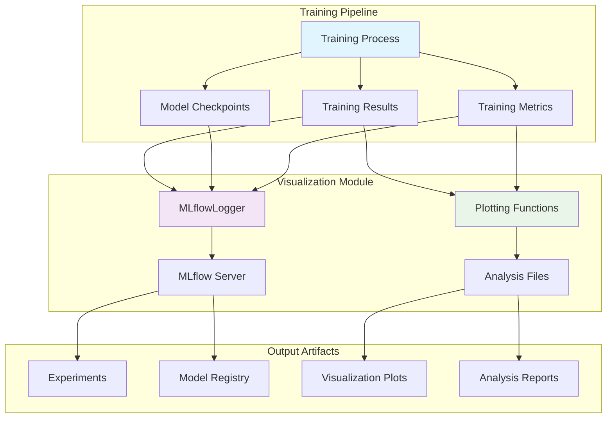
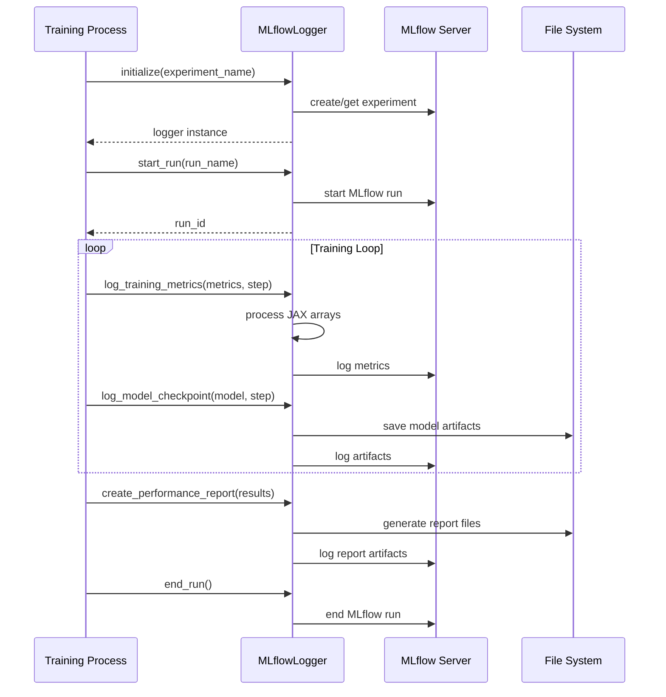
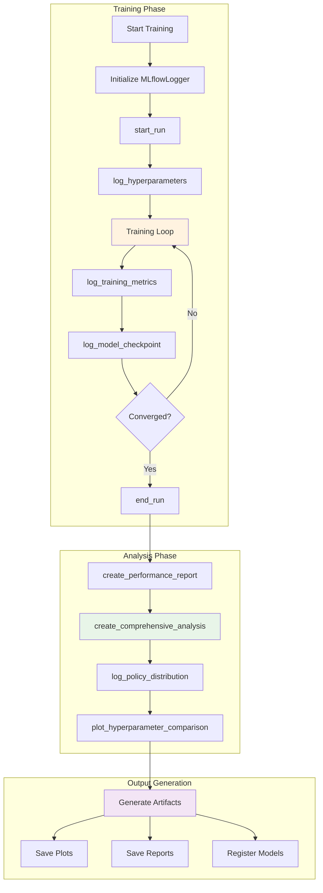
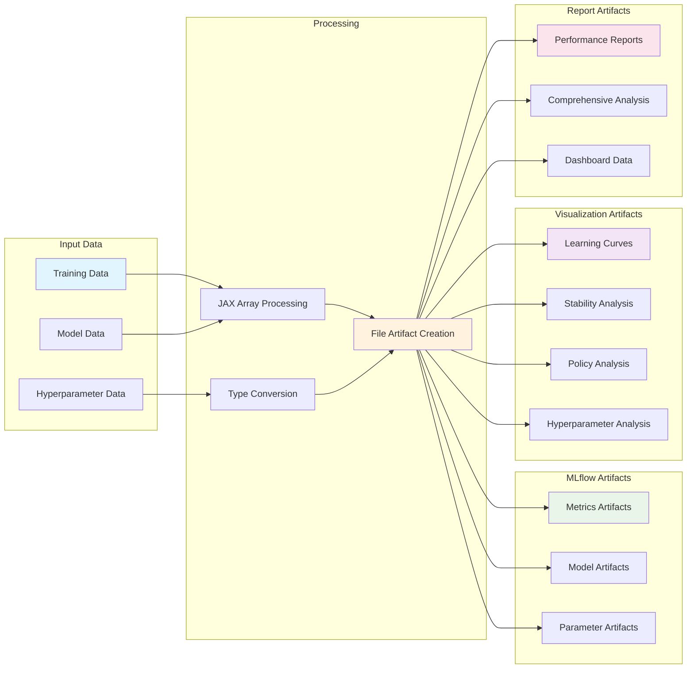
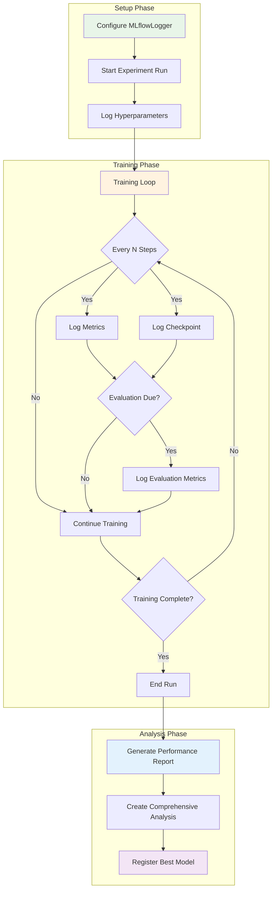

# Visualization Module

The `src/visualization` module provides comprehensive visualization and experiment tracking capabilities for the CartPole PPO implementation using JAX. It integrates with MLflow for experiment tracking and offers various plotting utilities for analyzing training progress, policy behavior, and hyperparameter performance.

## Module Structure

```
src/visualization/
├── __init__.py          # Module initialization
├── mlflow_logger.py     # MLflow integration and experiment tracking
├── plots.py            # Visualization utilities and plotting functions
└── README.md           # This documentation
```

## Architecture Overview



## Core Components

### MLflowLogger (`mlflow_logger.py`)

The `MLflowLogger` class provides comprehensive experiment tracking with MLflow 3.1.3, supporting:

- **Experiment Management**: Create and manage MLflow experiments
- **Model Logging**: Log Flax models with proper serialization
- **Metrics Tracking**: Log training, evaluation, and episode metrics
- **Hyperparameter Logging**: Track hyperparameter configurations
- **Artifact Management**: Save plots, models, and analysis results
- **Model Registry**: Register and version trained models

#### Key Methods

- `start_run(run_name)`: Initialize a new MLflow run
- `log_training_metrics(metrics, step)`: Log training metrics with JAX array handling
- `log_model_checkpoint(model, step, metrics)`: Save model checkpoints with associated metrics
- `log_policy_distribution(action_probs, observations, step)`: Log policy analysis plots
- `create_performance_report(training_results)`: Generate detailed performance analysis
- `search_best_models()`: Find best performing models using MLflow search API

#### MLflowLogger Workflow



#### Usage Example

```python
from src.visualization import MLflowLogger

# Initialize logger
logger = MLflowLogger(experiment_name="cartpole-ppo-experiment")

# Start a run
run_id = logger.start_run(run_name="ppo-training-run")

# Log hyperparameters
logger.log_hyperparameters({
    'learning_rate': 0.001,
    'batch_size': 64,
    'epochs': 1000
})

# Log training metrics
logger.log_training_metrics({
    'episode_reward': 185.5,
    'policy_loss': 0.234,
    'value_loss': 0.156
}, step=100)

# Log model checkpoint
model_id = logger.log_model_checkpoint(model, step=100, metrics={'accuracy': 0.95})

# End run
logger.end_run()
```

### Plotting Utilities (`plots.py`)

The `plots.py` module provides extensive visualization capabilities for training analysis:

#### Training Progress Visualization

- `plot_training_curves(rewards, losses)`: Basic training progress with rewards and losses
- `plot_advanced_learning_curves(rewards, losses, eval_rewards)`: Comprehensive learning analysis with multiple window sizes
- `plot_episode_statistics(episode_lengths, rewards)`: Episode-level statistics and distributions

#### Policy Analysis

- `plot_policy_distribution(action_probs, observations)`: Analyze policy behavior over time
  - Action probability evolution
  - Policy entropy tracking
  - Confidence metrics
  - Probability distributions

#### Stability and Performance Analysis

- `plot_training_stability(rewards, window_size)`: Training stability metrics
  - Rolling mean and standard deviation
  - Coefficient of variation
  - Performance consistency analysis
- `create_comprehensive_analysis(training_data, save_dir)`: Generate complete analysis report

#### Hyperparameter Analysis

- `plot_hyperparameter_comparison(results, metric)`: Compare different hyperparameter configurations
- `plot_hyperparameter_heatmap(results, metric)`: Visualize hyperparameter performance as heatmap

#### Plotting Function Hierarchy

```mermaid
graph TD
    subgraph "Core Plotting Functions"
        PTC[plot_training_curves]
        PALC[plot_advanced_learning_curves]
        PES[plot_episode_statistics]
        PPD[plot_policy_distribution]
        PTS[plot_training_stability]
    end
    
    subgraph "Analysis Functions"
        PHC[plot_hyperparameter_comparison]
        PHH[plot_hyperparameter_heatmap]
        CTS[create_training_summary_plot]
        CCA[create_comprehensive_analysis]
    end
    
    subgraph "Data Sources"
        R[Episode Rewards]
        L[Loss Values]
        ER[Evaluation Rewards]
        EL[Episode Lengths]
        AP[Action Probabilities]
        OBS[Observations]
        HP[Hyperparameters]
    end
    
    subgraph "Output Formats"
        PNG[PNG Files]
        JSON[JSON Data]
        HTML[HTML Reports]
    end
    
    R --> PTC
    R --> PALC
    R --> PES
    R --> PTS
    R --> CTS
    
    L --> PTC
    L --> PALC
    L --> CTS
    
    ER --> PALC
    EL --> PES
    
    AP --> PPD
    OBS --> PPD
    
    HP --> PHC
    HP --> PHH
    HP --> CTS
    
    CCA --> PTC
    CCA --> PALC
    CCA --> PES
    CCA --> PTS
    CCA --> CTS
    
    PTC --> PNG
    PALC --> PNG
    PES --> PNG
    PPD --> PNG
    PTS --> PNG
    PHC --> PNG
    PHH --> PNG
    CTS --> PNG
    CCA --> PNG
    CCA --> JSON
    CCA --> HTML
    
    style PTC fill:#e3f2fd
    style PALC fill:#e3f2fd
    style PES fill:#e3f2fd
    style PPD fill:#e3f2fd
    style PTS fill:#e3f2fd
    style CCA fill:#f1f8e9
```



#### Usage Examples

```python
from src.visualization.plots import (
    plot_advanced_learning_curves,
    plot_policy_distribution,
    create_comprehensive_analysis
)

# Plot advanced learning curves
plot_advanced_learning_curves(
    rewards=episode_rewards,
    losses={'policy_loss': policy_losses, 'value_loss': value_losses},
    eval_rewards=eval_rewards,
    save_path="analysis/learning_curves.png"
)

# Analyze policy distribution
plot_policy_distribution(
    action_probs=action_probabilities,
    observations=states,
    save_path="analysis/policy_analysis.png"
)

# Create comprehensive analysis
create_comprehensive_analysis(
    training_data={
        'episode_rewards': episode_rewards,
        'losses': losses,
        'episode_lengths': episode_lengths,
        'hyperparams': hyperparameters
    },
    save_dir="analysis/comprehensive"
)
```

## Integration with Training Pipeline

The visualization module integrates seamlessly with the training pipeline:

1. **During Training**: Log metrics, model checkpoints, and intermediate analysis
2. **Post-Training**: Generate comprehensive analysis reports and performance summaries
3. **Hyperparameter Tuning**: Compare different configurations and identify optimal settings

### Training Pipeline Integration Flow



### MLflow Integration Features

- **Automatic JAX Array Handling**: Converts JAX arrays to Python scalars for MLflow compatibility
- **Model Versioning**: Track model evolution with step-based checkpointing
- **Experiment Comparison**: Compare runs and identify best performing configurations
- **Dashboard Creation**: Generate MLflow-compatible dashboards for experiment tracking

## Configuration

### Environment Variables

- `MLFLOW_TRACKING_URI`: MLflow server URI (default: `http://localhost:5000`)
- `MLFLOW_BACKEND_STORE_URI`: Backend store URI (default: `sqlite:///data/mlflow.db`)

### MLflow Server Setup

```bash
# Start MLflow server
nix develop --command just start-mlflow

# Stop MLflow server
nix develop --command just stop-mlflow
```

## Output Artifacts

The visualization module generates various artifacts:

### Training Analysis
- Learning curves with multiple window sizes
- Loss evolution plots
- Episode statistics and distributions
- Training stability analysis

### Policy Analysis
- Action probability evolution
- Policy entropy tracking
- Confidence metrics over time
- Probability distribution histograms

### Performance Reports
- Comprehensive performance summaries
- Convergence analysis
- Statistical benchmarks
- Hyperparameter comparison heatmaps

### Artifact Generation Pipeline



## Dependencies

- `matplotlib`: Core plotting functionality
- `seaborn`: Advanced statistical visualizations
- `numpy`: Numerical computations and array handling
- `mlflow`: Experiment tracking and model registry
- `pathlib`: File path handling
- `tempfile`: Temporary file management for artifacts

## Best Practices

1. **Consistent Logging**: Use the MLflowLogger for all experiment tracking
2. **Regular Checkpoints**: Log model checkpoints at regular intervals
3. **Comprehensive Analysis**: Use `create_comprehensive_analysis()` for complete training reports
4. **Hyperparameter Tracking**: Log all hyperparameters for reproducibility
5. **Artifact Organization**: Use structured artifact paths for better organization

### Recommended Workflow



## Error Handling

The module includes robust error handling:
- Graceful degradation when MLflow server is unavailable
- Warning messages for failed logging operations
- Automatic type conversion for JAX arrays and complex data structures
- Safe file handling with proper directory creation

## Performance Considerations

- **Memory Efficiency**: Uses temporary directories for artifact generation
- **Batch Operations**: Supports batch logging of metrics and parameters
- **Selective Logging**: Only logs numeric metrics to avoid MLflow limitations
- **Optimized Plotting**: Efficient matplotlib usage with proper figure cleanup